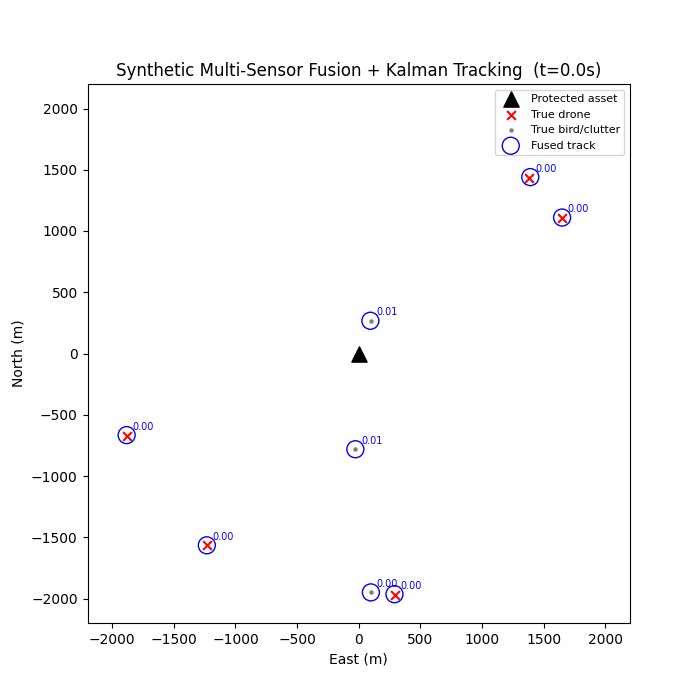

# Counter-Swarm Fusion Engine

### Synthetic Multi-Sensor Simulator and Kalman Tracker

A self-contained prototype of a SAPIENT-aligned multi-sensor fusion and tracking engine for counter-drone (C-UAS) systems. The project generates a synthetic drone swarm scenario, simulates noisy multi-sensor observation using radar, passive RF, and EO camera models, fuses cross-sensor detections, tracks objects over time with a Kalman filter, and produces a threat score per track. All of this is exposed through a live API with a browser-based real-time visualization.

This project is scoped intentionally as a fusion software prototype. It does not contain sensor design, jamming, or interceptor logic. The goal is to demonstrate the architecture used by a real C-UAS fusion and command-and-control layer. See the Design Notes section below for details.



## Quick Start

```bash
pip install -r requirements.txt

# Run the simulation. Produces outputs/tracking_demo.gif and outputs/metrics.json
python demo.py

# Run the live API and browser demo
uvicorn api:app --reload --port 8000
# Then open http://localhost:8000/demo/ in a browser
```

## System Overview

| Module | Responsibility |
|---|---|
| `simulator/targets.py` | Generates ground truth trajectories for a swarm of drones approaching a protected point, plus bird and clutter decoys with more erratic motion. |
| `simulator/sensors.py` | Models three synthetic sensors (radar, passive RF, EO camera). Each sensor observes the ground truth at every timestep with its own noise profile, detection probability, false alarm rate, range limit, and classification capability. |
| `tracker/kalman.py` | Implements a constant-velocity Kalman filter for each track. |
| `tracker/association.py` | Performs gated nearest-neighbor data association using the Hungarian algorithm with Mahalanobis-distance gating. Described as "JPDA-lite" since it commits to a single best global assignment rather than maintaining full probabilistic hypotheses. |
| `tracker/track_manager.py` | Fuses same-instant cross-sensor detections that are spatially close (mirroring SAPIENT's `associated_detection` and `derived_detection` relationship). Associates fused detections to existing tracks. Updates each track's Kalman filter. Maintains track lifecycle states (TENTATIVE, CONFIRMED, DROPPED). |
| `demo.py` | Runs the full pipeline. Renders an animated visualization. Computes tracking and classification metrics. |
| `api.py` | Serves a FastAPI backend exposing live track state. Mirrors how a real fusion engine would sit behind an API consumed by a downstream C2 system or effector integrator. |
| `static/index.html` | A browser-based live demo that polls the API and renders tracks on a canvas in real time. |

## Results

Representative run: 5 drones and 3 decoys over a 120 second scenario.

| Metric | Value |
|---|---|
| True threats in final frame | 5 |
| Confirmed tracks in final frame | 8 |
| Total tracks in final frame | 9 |
| Mean threat score on real drones | 1.00 |
| Mean threat score on real decoys | ~0.00 |

The separation in threat score between real drones and decoys is clean in this run. This result is partly a genuine effect of fusing two independent classifying sensors (RF and EO) and partly an artifact of the simplified classification fusion model described under Known Limitations. Nine tracks formed for eight true targets is close to ideal. Some residual fragmentation from false alarms is expected and is the correct thing to tune next rather than something to conceal.

## Design Notes: Alignment with the SAPIENT Standard

This project mirrors the semantics of the real SAPIENT Interface Control Document (DSTL/PUB145591) rather than introducing an ad hoc data model.

**Detection, fusion, and track are treated as three distinct relationships.** A `DetectionReport` represents one sensor's instantaneous report. Fusion combines same-instant cross-sensor detections through the `associated_detections` and `derived_detections` fields defined in `schema.py`. A track is a time series of fused detections sharing a single `object_id` or `track_id`. Conflating these three concepts is a common architectural error in fusion systems. This codebase keeps them separate by design.

**Each sensor declares its own capability profile.** Every `SyntheticSensor` instance declares its detection probability, false alarm rate, location error, and classification capability. This mirrors SAPIENT's Registration message, in which each node reports only the fields its specific capability profile supports.

**Track lifecycle states model operator trust.** The TENTATIVE, CONFIRMED, and DROPPED states mirror how a real Decision Making Module manages track confidence before recommending an engagement response.

## Known Limitations

These limitations are documented intentionally as a record of engineering tradeoffs rather than omissions to be hidden.

**Classification fusion is naive.** The current implementation uses a simple multiplicative Bayesian update that becomes overconfident after only a few observations and drives scores toward 0 or 1 too quickly. A more principled approach would use calibrated likelihood ratios or a proper Bayesian fusion model such as a Beta-Binomial or Dirichlet formulation.

**The motion model assumes constant velocity.** Real drones maneuver. An Interacting Multiple Model filter blending constant-velocity and constant-acceleration or coordinated-turn models would track maneuvering targets more accurately.

**Data association uses greedy nearest-neighbor assignment rather than full JPDA.** Under dense swarms with overlapping gates, a probabilistic data association approach would handle ambiguous assignments more gracefully than committing to a single global least-cost assignment at every timestep.

**Measurement covariance is shared rather than per-detection.** A production system would carry per-detection covariance through fusion and into the Kalman update rather than using a single shared value during association.

**Track fragmentation and duplication were observed during development.** This was partially addressed with a duplicate-suppression heuristic in `track_manager.py`. A more principled fix would tune process noise and gate thresholds per sensor rather than globally, or merge tracks through explicit track-to-track association.

## Next Steps

1. Replace the naive classification fusion model with a calibrated probabilistic model.
2. Add an Interacting Multiple Model filter to handle maneuvering targets.
3. Move from gated nearest-neighbor association to full JPDA or a multi-hypothesis tracker for dense swarm scenarios.
4. Replace the synthetic sensors with adapters that speak the real SAPIENT Protobuf wire format. The official `.proto` definitions can be requested from the SAPIENT Interface Management Panel at SAPIENT@dstl.gov.uk.
5. Extend the live demo to a WebSocket-based architecture so the server pushes track updates rather than the client polling for them.

## License

This project is released under the MIT License.
